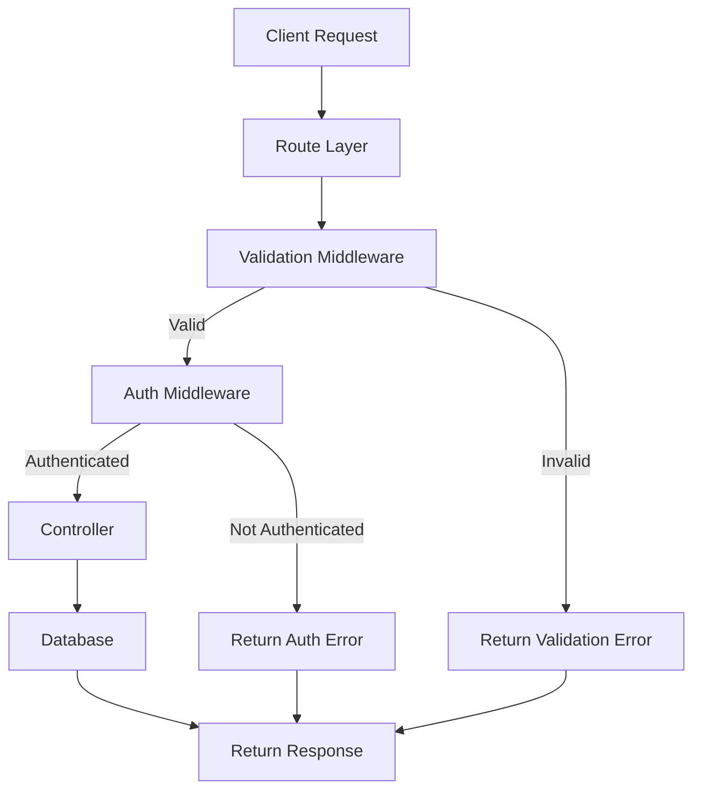

# To-Do List API with Auth (Express + MongoDB + Joi)

## Project Structure
```
server/  
├── config/  
│ └── db.js # MongoDB connection  
├── controllers/  
│ ├── auth.controller.js # register & login logic  
│ └── todo.controller.js # CRUD logic  
├── middleware/  
│ ├── validate.js # Joi validation middleware  
│ └── auth.js # JWT auth middleware  
├── models/  
│ ├── user.model.js # User Mongoose model  
│ └── todo.model.js # Todo Mongoose model  
├── routes/  
│ ├── auth.routes.js # Auth routes  
│ └── todo.routes.js # Todo routes  
├── schemas/  
│ ├── auth.schema.js # Joi schemas for auth  
│ └── todo.schema.js # Joi schemas for todo  
├── utils/  
│ └── apiResponse.js # Reusable API response class  
├── server.js  
└── .env
````

---

## Key Concepts

### API Response
```js
ApiResponse.success(res, data, message, statusCode)
ApiResponse.error(res, message, statusCode, error)
````

### Joi Validation
- `abortEarly: true` → first error only (good for auth)
- `abortEarly: false` → list all errors (good for forms)
- Validation middleware example:
```js
export const validate = (schema, options = { abortEarly: true }) => (req, res, next) => {
  const { error } = schema.validate(req.body, options);
  if (error) return res.status(400).json({ ... });
  next();
};
```
### Auth Middleware
- JWT-based authentication
```js
const auth = (req, res, next) => {
  const token = req.headers.authorization?.split(" ")[1];
  if (!token) return ApiResponse.error(res, "No token", 401);
  try {
    const decoded = jwt.verify(token, process.env.JWT_SECRET);
    req.user = decoded;
    next();
  } catch {
    return ApiResponse.error(res, "Invalid token", 401);
  }
};
```

### Models
- **User**: username, email, password
- **Todo**: title, completed, user (ref User)
### Schemas (Joi)
- Example `createTodoSchema`:
```js
export const createTodoSchema = Joi.object({
  title: Joi.string().min(3).required().messages({
    "string.empty": "Title is required",
    "string.min": "Title must be at least 3 characters",
  }),
  completed: Joi.boolean().default(false),
});
```

---

## Flow Diagram (Mermaid)



### Explanation:
- **Client Request** → hits a **Route**.
- **Validation Middleware** checks input:
    - If invalid → return **error**.
    - If valid → proceed.
- **Auth Middleware** checks JWT (if route requires auth):
    - If not authenticated → return **error**.
    - If authenticated → proceed to **Controller**.
- **Controller** executes business logic → interacts with **MongoDB** → returns response via **ApiResponse**.

---

### Notes / Best Practices
- Keep **models and Joi schemas separate** for medium/large projects.
- Use **ApiResponse class** for consistent API responses.
- Use **abortEarly** wisely depending on the endpoint.
- Pagination & query validation can use Joi on `req.query`.
- Small projects can mix Joi schemas into model files for simplicity.